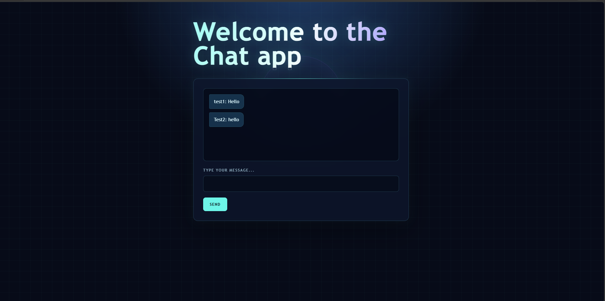

# Aplikacja czatowa

Prosta aplikacja czatowa umożliwiająca komunikację wielu użytkowników w czasie rzeczywistym za pomocą WebSocketów.

Projekt został wykonany na podstawie pomysłu [Chat App z App Ideas](https://github.com/florinpop17/app-ideas/blob/master/Projects/3-Advanced/Chat-App.md#chat-app).

## Podgląd aplikacji




**Poziom projektu:** 3 - Zaawansowany

## Spis treści

- [Opis projektu](#opis-projektu)
- [Technologie](#technologie)
- [Funkcje](#funkcje)
- [Struktura projektu](#struktura-projektu)
- [Uruchomienie](#uruchomienie)
- [Historie użytkowników](#historie-użytkowników)
- [Zrealizowane kroki](#zrealizowane-kroki)
- [Planowane ulepszenia](#planowane-ulepszenia)
- [Problemy](#najczęstsze-problemy)

## Opis projektu

Celem projektu było stworzenie interfejsu czatu, w którym użytkownik może:

- podać swoją nazwę,
- wysłać wiadomość,
- zobaczyć wiadomości innych użytkowników,
- komunikować się z innymi osobami w czasie rzeczywistym.

## Technologie

- HTML5
- CSS3
- JavaScript
- Node.js
- WebSocket
- Biblioteka `ws`

## Funkcje

- Formularz logowania z nazwą użytkownika.
- Zapisywanie nazwy użytkownika w `localStorage`.
- Wysyłanie wiadomości tekstowych.
- Wyświetlanie nazwy autora przy wiadomości.
- Rozsyłanie wiadomości do wszystkich połączonych użytkowników.
- Informowanie o dołączeniu użytkownika do czatu.
- Informowanie o opuszczeniu czatu.

## Struktura projektu

```text
Chat-app/
├── index.html
├── README.md
├── package.json
├── css/
│   └── style.css
├── js/
│   └── app.js
└── server/
    └── server.js
```

## Wymagania

Do uruchomienia projektu potrzebujesz:

- Node.js
- npm
- przeglądarki internetowej

Sprawdzenie instalacji:

```powershell
node --version
npm --version
```

## Uruchomienie

Sklonuj repozytorium:

```powershell
git clone ADRES_REPOZYTORIUM
```

Przejdź do folderu projektu:

```powershell
cd Chat-app
```

Zainstaluj zależności:

```powershell
npm install
```

Uruchom serwer WebSocket:

```powershell
node server/server.js
```

Następnie otwórz plik `index.html` w przeglądarce, najlepiej za pomocą rozszerzenia Live Server w Visual Studio Code.

Aby przetestować komunikację:

1. Otwórz aplikację w dwóch kartach.
2. W każdej karcie wpisz inną nazwę użytkownika.
3. Wyślij wiadomość z jednej karty.
4. Sprawdź, czy wiadomość pojawiła się w obu kartach.

## Historie użytkowników

- Użytkownik jest proszony o podanie nazwy przed wejściem do czatu.
- Nazwa użytkownika jest zapisywana w aplikacji.
- Użytkownik może wpisać nową wiadomość.
- Użytkownik może wysłać wiadomość przyciskiem.
- Wiadomość jest wyświetlana razem z nazwą autora.

Przykład:

```text
John Doe: Hello World!
```

## Zrealizowane kroki

- Utworzono strukturę aplikacji.
- Przygotowano interfejs HTML.
- Dodano style CSS.
- Dodano formularz nazwy użytkownika.
- Dodano zapisywanie nazwy w `localStorage`.
- Dodano formularz wiadomości.
- Utworzono serwer Node.js.
- Dodano komunikację WebSocket.
- Dodano rozsyłanie wiadomości do wszystkich użytkowników.
- Dodano komunikaty o dołączaniu i opuszczaniu czatu.

## Planowane ulepszenia

- Lista aktywnych użytkowników.
- Data i godzina wysłania wiadomości.
- Możliwość zmiany nazwy użytkownika.
- Pokoje czatu.
- Obsługa emotikonów.
- Zapisywanie historii wiadomości.
- Lepsze rozróżnienie wiadomości własnych i cudzych.
- Obsługa błędów połączenia.
- Responsywność na urządzeniach mobilnych.

## Zatrzymanie serwera

Aby zatrzymać serwer, użyj:

```text
Ctrl + C
```

## Najczęstsze problemy

### Node.js lub npm nie działa

Zainstaluj Node.js ze strony:

[https://nodejs.org/](https://nodejs.org/)

Po instalacji uruchom ponownie terminal.

### Nie można połączyć się z WebSocketem

Sprawdź, czy serwer działa:

```powershell
node server/server.js
```

Sprawdź również adres w pliku `app.js`:

```js
const socket = new WebSocket("ws://localhost:8080");
```

### Port 8080 jest zajęty

Zamknij poprzedni serwer albo użyj innego portu w `server.js`.

## Autor

Projekt wykonany jako aplikacja edukacyjna do nauki JavaScriptu, Node.js i WebSocketów.
